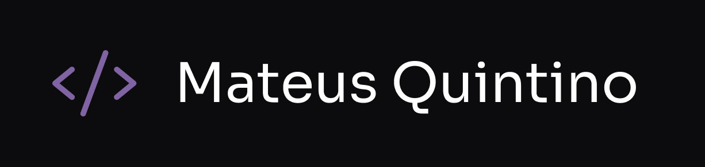
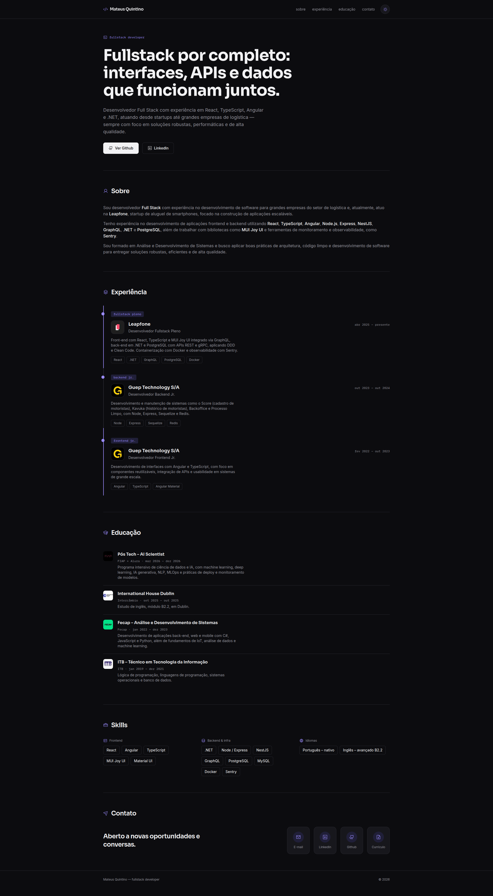

# Mateus Quintino — Portfólio



## Portfólio pessoal, apresentando minha trajetória e experiência como desenvolvedor Full Stack

[](https://mateus-quintino.dev)

🔗 Acesse: **[mateus-quintino.dev](https://mateus-quintino.dev)**

## 💻 Preview



## 👨‍💻 Este projeto foi desenvolvido com as seguintes tecnologias

### Next.js

Framework React para produção, com App Router, renderização híbrida (estática/servidor) e geração de metadados (SEO, Open Graph) nativa.

Site: <https://nextjs.org>

### React

Biblioteca para construção de interfaces baseadas em componentes.

Site: <https://react.dev>

### TypeScript

Superset de JavaScript com tipagem estática, usado em todo o projeto para segurança de tipos e melhor DX.

Site: <https://www.typescriptlang.org>

### Tailwind CSS

Framework CSS utility-first, usado para estilização com um design system consistente (cores, espaçamento e tipografia centralizados via tokens).

Site: <https://tailwindcss.com>

### Framer Motion

Biblioteca de animações para React, usada nas transições de entrada e nos efeitos de *reveal* ao rolar a página.

Site: <https://motion.dev>

### Phosphor Icons

Biblioteca de ícones flexível para interfaces.

Site: <https://phosphoricons.com>

### next-themes

Gerenciamento de tema claro/escuro sem *flash* de conteúdo, com persistência e detecção da preferência do sistema.

Site: <https://github.com/pacocoursey/next-themes>

### Biome

Formatter e linter usado no lugar de ESLint + Prettier, garantindo um padrão de código único e rápido em todo o projeto.

Site: <https://biomejs.dev>

## 🔖 Estrutura do site

- **Header** — navegação fixa e alternância de tema
- **Hero** — apresentação inicial
- **Sobre** — resumo da minha experiência
- **Experiência** — linha do tempo profissional
- **Educação** — formação acadêmica e cursos
- **Skills** — stack técnica e idiomas
- **Contato** — e-mail, redes sociais e currículo para download

## 🚀 Rodando localmente

### Pré-requisitos

- [Node.js](https://nodejs.org) 20+
- [pnpm](https://pnpm.io)

### Instalação

```bash
git clone https://github.com/Mateus-Kent/mateus-quintino.dev.git
cd mateus-quintino.dev
pnpm install
```

### Scripts disponíveis

| Comando | Descrição |
| --- | --- |
| `pnpm dev` | Inicia o servidor de desenvolvimento |
| `pnpm build` | Gera o build de produção |
| `pnpm start` | Sobe o build de produção localmente |
| `pnpm lint` | Verifica o código com o Biome |
| `pnpm lint:fix` | Corrige automaticamente o que o Biome permitir |
| `pnpm typecheck` | Verifica os tipos com o TypeScript |

Com o servidor rodando, acesse [http://localhost:3000](http://localhost:3000).
